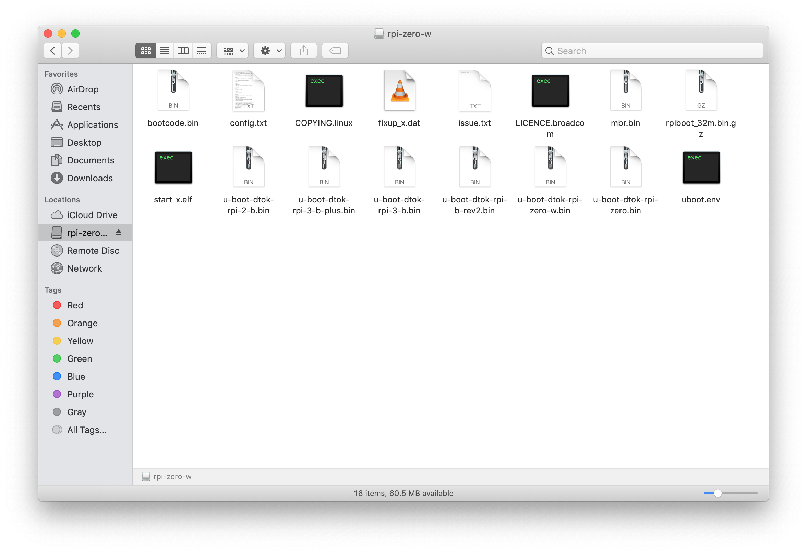
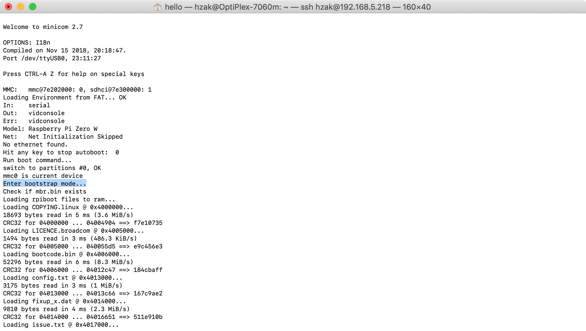
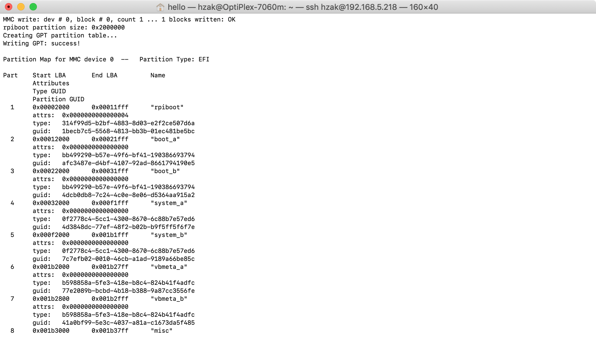
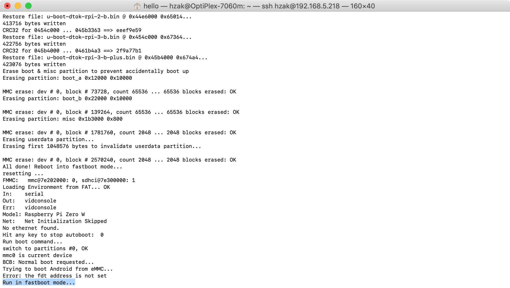
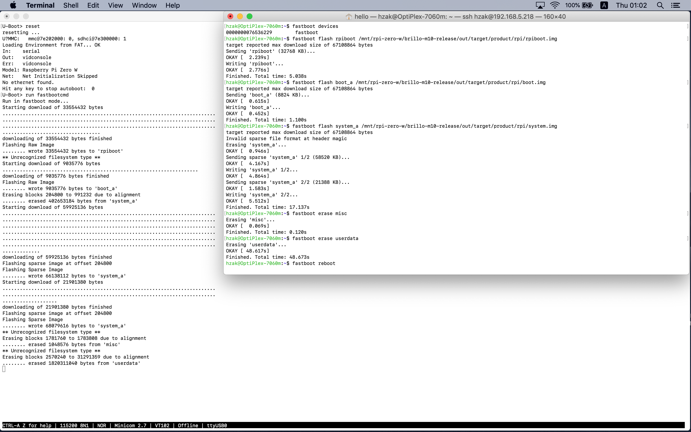
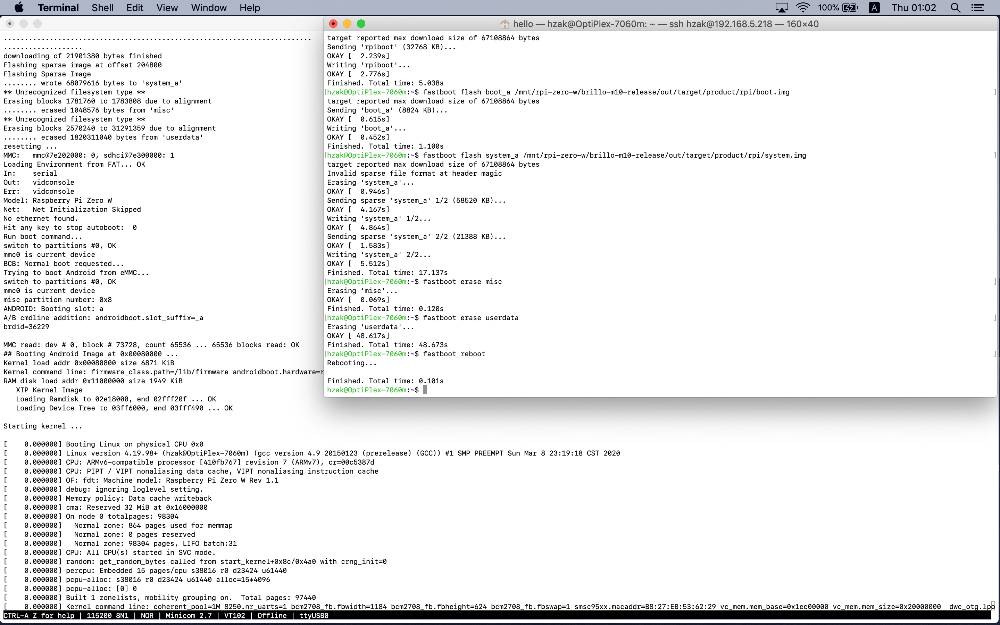
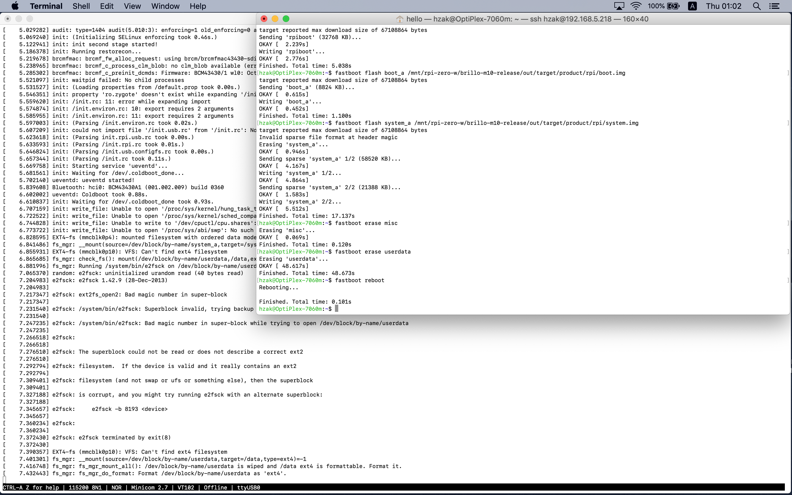

# rpi0w-brillo-m10-u-boot-binary
Binary files to boot up an Android based operating system for Raspberry Pi Zero W

#### Overview
The primary goal of this project is build a bootloader that can easy to flash Android based operating system for Raspberry Pi Zero W.

#### Supported targets

Raspberry Pi Model | U-boot configuration | Fastboot protocol
:-------------- | :------------------------------------- | :--------------
Raspberry Pi Model B Rev2   | u-boot-rpi-b-rev2.cfg   | Over UDP
Raspberry Pi Zero           | u-boot-rpi-zero.cfg     | Over USB
Raspberry Pi Zero W         | u-boot-rpi-zero-w.cfg   | Over USB
Raspberry Pi 2 Model B      | u-boot-rpi-2-b.cfg      | Over UDP
Raspberry Pi 3 Model B      | u-boot-rpi-3-b.cfg      | Over UDP
Raspberry Pi 3 Model B+     | u-boot-rpi-3-b-plus.cfg | Over UDP


#### Download source code and build tools
1. Download the U-boot source code from https://github.com/brobwind/rpi0w-brillo-m10-u-boot.git
```bash
$ git clone -b rpi0w-brillo-m10-dev https://github.com/brobwind/rpi0w-brillo-m10-u-boot.git
```

2. Download the U-boot configuration file from this repo (Raspberry Pi Zero W)
```bash
$ curl https://raw.githubusercontent.com/brobwind/rpi0w-brillo-m10-u-boot-binary/rpi0w-brillo-m10-dev/u-boot-rpi-zero-w.cfg > rpi0w-brillo-m10-u-boot/.config
```

3. Download the U-boot env source file from this repo
```bash
$ curl https://raw.githubusercontent.com/brobwind/rpi0w-brillo-m10-u-boot-binary/rpi0w-brillo-m10-dev/u-boot-env.cfg > rpi0w-brillo-m10-u-boot/u-boot-env.cfg
```

4. Download the cross compiler from https://android.googlesource.com/platform/prebuilts/gcc/linux-x86/arm/arm-linux-androideabi-4.9
``` bash
$ git clone -b brillo-m10-release https://android.googlesource.com/platform/prebuilts/gcc/linux-x86/arm/arm-linux-androideabi-4.9
```

5. Download mkknlimg from https://github.com/raspberrypi/linux/blob/rpi-4.14.y/scripts/mkknlimg
```bash
$ curl https://raw.githubusercontent.com/raspberrypi/linux/rpi-4.14.y/scripts/mkknlimg > rpi0w-brillo-m10-u-boot/mkknlimg
$ chmod +x rpi0w-brillo-m10-u-boot/mkknlimg
```

#### Build
Assuming current path is rpi0w-brillo-m10-u-boot which the U-boot source code located, execute following commands will build a 32-bit u-boot.
1. Make
```bash
$ ARCH=arm CROSS_COMPILE=../arm-linux-androideabi-4.9/bin/arm-linux-androideabi- make olddefconfig
$ ARCH=arm CROSS_COMPILE=../arm-linux-androideabi-4.9/bin/arm-linux-androideabi- make
```

2. Add a trailer
```bash
$ ./mkknlimg --dtok --ddtk --270x u-boot.bin u-boot-dtok-rpi-zero-w.bin
```

3. Create uboot.env file
```bash
$ tools/mkenvimage -s $((16 * 1024)) -o uboot.env u-boot-env.cfg
```

#### Usage
1. A micro SD card, make a MBR partition table and format the first partition to FAT file system. Then copy all the files under rpiboot folder to the first partition


2. Insert the Micro SD card to the Raspberry Pi W's micro SD card slot

3. Power on
 - Enter bootstrap mode: Copy all files to RAM


 - Create GPT and hybrid MBR partition table and then recovery all files to SD card


 - Reboot into fastboot mode


 - Flash images by using fastboot command


 - Boot up Android based system


 - Format userdata partition



#### Licence

Unless otherwise specified, everything in this repository is covered by the Apache License 2.0
